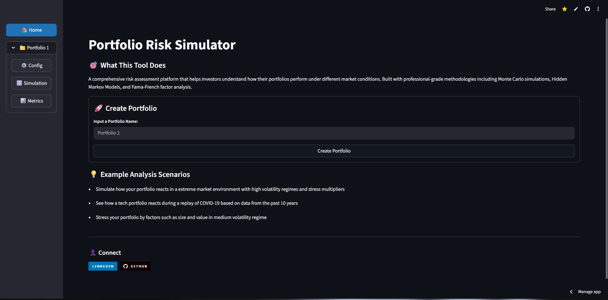
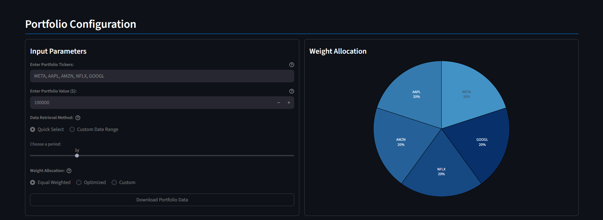
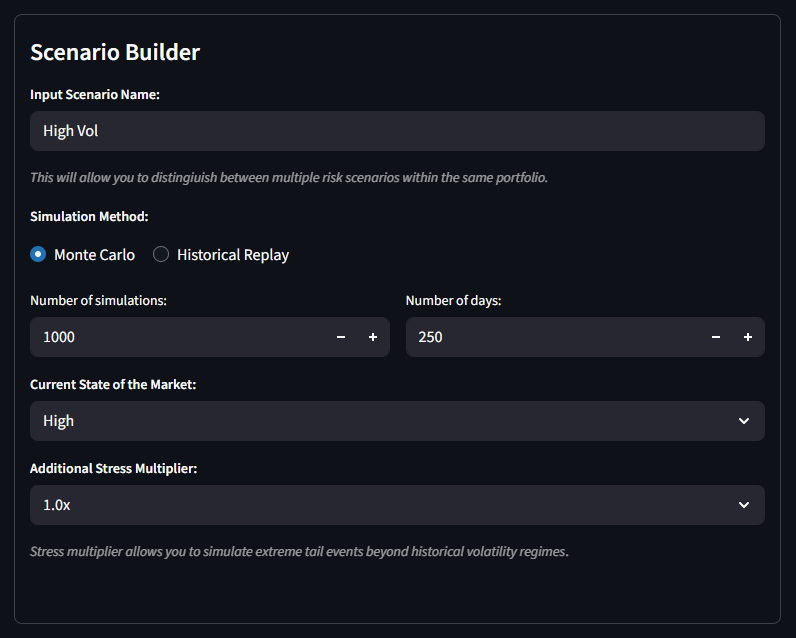
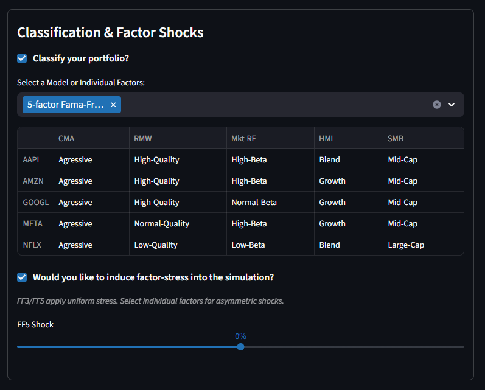
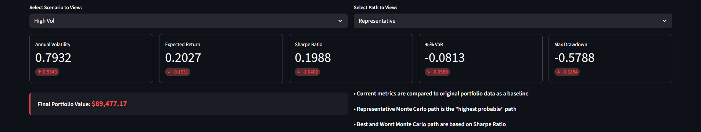
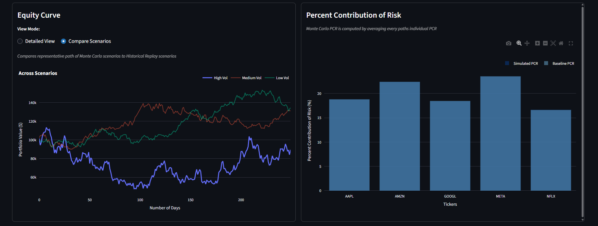
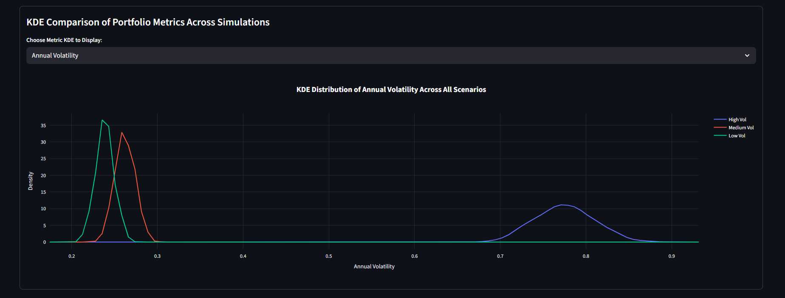

# Portfolio Risk Simulator

[](https://www.python.org/)
[](LICENSE)

A comprehensive Python application built with professional risk-assessment methodologies to help investors and analysts understand how different market scenarios affect portfolio performance. This tool provides institutional-grade risk modeling capabilities through an intuitive web interface.


## 🚀 Features

#### **Interface & Navigation**

- **Interactive Web Interface:** Streamlit-based UI with intuitive navigation and real-time updates

- **Efficient Multi-Portfolio Management:** Create and compare multiple portfolios with clean sidebar navigation

- **Real-time Finanical Data Integration:** Automated data fetching using yfinance

#### **Portfolio Configuration**

- **Flexible Asset Selection:** Support for custom tickers and investment amounts

- **Advanced Weight Allocation**: Choose from equal weights, Sharpe ratio-optimized weights, or custom weights

- **Initial Portfolio Analytics:** Dynamic pie charts and normalized price history visualizations using Plotly for immediate portfolio insights

#### **Risk Simulation Engine**

- **Monte Carlo Simulations:** Advanced engine integrated with  Hidden Markov Models to model different volatility regimes (Low, Medium, High volatility states) 

- **Extreme Event Modeling**: Apply additional stress multipliers (1.15x, 1.25x, 1.35x, 1.5x) on top of HMM volatility regimes to simulate tail risk events beyond historical market conditions

- **Historical Crisis Replay:** Stress test portfolios using actual historical events such as: 
    - COVID-19 
    - 2008 Global Financial Crisis 
    - Dot-Com Bubble 
    - 2011 Eurozone Crisis
    - 2022 Inflation Crash

#### **Advanced Risk Analysis**

- **Factor Classification & Stress Testing:** Classify and apply user-defined shocks on Fama-French factors (3-factor and 5-factor models) and Momentum to reveal and test specific portfolio exposures

- **Multi-Path Analysis:** View best-case, worst-case based on Sharpe Ratio, or most probable (representative) simulation paths

- **Key Risk Metrics:** Calculate and display:
    - Annual volatility
    - Expected Return
    - Sharpe Ratio
    - 95% Value-at-Risk (VaR)
    - Maximum Drawdown

#### **Results Visualization & Analysis**

- **Baseline Comparison:** Visual delta analysis between simulation results and historical baseline metrics

- **Portfolio Value Tracking:** Displays projected final portfolio value based on initial investment

- **Interactive Equity Curve:** Compare performance paths across scenarios with dynamic Plotly visualizations

- **Dynamic Scenario Highlighting:** Current scenario/path automatically highlighted on cumulative portfolio value charts for improved clarity in analysis

- **Risk Attribution Analysis:** Percent Contribution of Risk (PCR) charts showing each asset's contribution to total portfolio volatility

- **Statistical Distribution Analysis:** Kernel Density Estimation (KDE) charts for comprehensive metric distribution comparisons across all scenarios

#### **Professional-Grade Capabilities**

- **Multi-Scenario Comparison:** Side-by-side analysis of different stress test scenarios

- **Regime-Based Modeling:** Hidden Markov Model integration for market state identification

- **Factor Model Integration:** Built on academic research from Fama-French factor models

- **Configuration Lock Mechanism:** Once portfolio and simulation configurations are confirmed, scenarios are locked to prevent accidental modifications and ensure result integrity

- **Interactive Decision Support:** Real-time parameter adjustment and immediate result visualization


## 📊 Screenshots


> Initialize a new portfolio and access the sidebar for scenario analysis.


> Define tickers, initial portfolio value, time frame, and weight allocation.


> View each asset's price performance for immediate analysis.


> Configure stress event characteristics via Monte Carlo or Historical Replay


> Optionally classify and shock your Monte Carlo scenario with market factors


> View key portfolio metrics for the current scenario relative to the baseline portfolio data metrics


> View equity curve across scenarios or across main paths for the current scenario and realize the percent contribution of risk for each asset


> Display the distribution for each metric across all scenarios in the portfolio


## 🏗️ Architecture

```
portfolio-risk-simulator/
├── .streamlit/
│   └── config.toml              # Streamlit configuration
├── app/
│   ├── __init__.py             # Makes app a Python package
│   ├── ui/
│   │   ├── __init__.py         # Makes ui a Python package  
│   │   ├── metrics_ui.py       # Results and visualization interface
│   │   ├── portfolio_ui.py     # Portfolio configuration interface
│   │   ├── simulation_ui.py    # Simulation configuration interface
│   │   └── utils_ui.py         # UI utility functions
│   ├── cached_functions.py     # Streamlit caching for performance
│   └── common.py               # Shared imports and constants
├── data/
│   ├── F-F_Momentum_Factor_daily.csv                    # Momentum factor data
│   └── F-F_Research_Data_5_Factors_2x3_daily.csv       # Fama-French factors
├── notebooks/
│   └── portfolio_risk_prototyping.ipynb                # Development and analysis notebook
├── src/
│   ├── __init__.py             # Makes src a Python package
│   ├── metrics.py              # Risk calculations and visualizations
│   ├── portfolio.py            # Portfolio initialization and optimization
│   └── simulation.py           # Monte Carlo and historical simulations
├── LICENSE
├── README.md
├── main.py                     # Streamlit app entry point
└── requirements.txt            # Python dependencies
```

## 💻 Installation

### Option 1: Use the application
https://portfolio-risk-sim.streamlit.app/

_Ready-to-use risk analysis tool_

### Option 2:  Run Locally 
For customization, development, or enhanced performance:

#### Prerequisites
- Python 3.7+
- pip package manager
- Git
    
#### **Setup**

**1. Clone the repository**
```
git clone https://github.com/csciulla/portfolio-risk-simulator.git
cd portfolio-risk-simulator
```

**2. Install dependencies**
```
pip install -r requirements.txt
```

**3. Run the application**
```
streamlit run main.py
```


## 📜 License 

This project is licensed under the terms of the 

## ⚠️ Disclaimer
This application is intended for educational purposes only. Investment involves risk, and past performance is not indicative of future results. Consult with a qualified financial advisor before making investment decisions.

## 👤 Contact

- **Email:** [christiansciulla@icloud.com](mailto:christiansciulla@icloud.com)
- **LinkedIn:** [christian-sciulla](https://www.linkedin.com/in/christian-sciulla)
- **GitHub:** [csciulla](https://github.com/csciulla)
